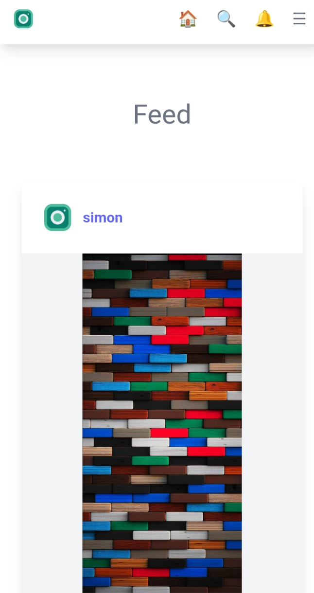
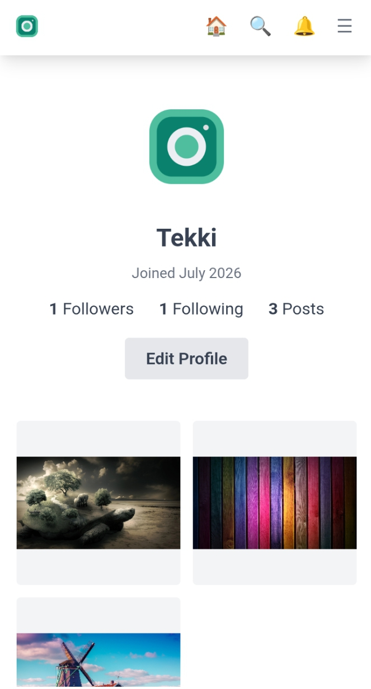

# PhotoApp

A lightweight, Instagram-style photo-sharing social app built with Django — post photos, follow people, like/comment, and discover content through hashtags, all with a guest-viewable public feed.

## Demo / Screenshots

## Demo / Screenshots

**Live demo:** https://social-media-photo-app.onrender.com/


<!-- Replace the lines below with your actual image paths or URLs -->

**Feed screenshot**


**Profile screenshot**


```


```
> Put your screenshot image files in a `docs/screenshots/` folder in the repo, then reference them above with the same relative path (or swap in your live demo URL once deployed).

## Features

- **User accounts** — registration (with password rules: 8+ characters, must include letters and numbers), login/logout, password reset
- **Public feed** — viewable by guests without an account; logging in unlocks liking, commenting, and more
- **Posts** — create, edit, and delete your own photo posts (with title + caption)
- **Likes** — like/unlike posts via AJAX (no page reload)
- **Comments** — comment on posts, edit or delete your own comments
- **Follow system** — follow/unfollow other users, view followers/following lists
- **Public profiles** — bio, location, website, join date, and a grid of a user's posts
- **Notifications** — get notified when someone likes, comments on, or follows you, with an unread-count badge
- **Search** — find other users by username
- **Hashtags** — `#tags` in captions are clickable and link to a filtered feed of matching posts
- **Bookmarks** — save posts to view later
- **Infinite scroll** — the feed loads more posts automatically as you scroll
- **Dark / light mode** — toggle, saved across visits
- **Share** — share a post's link via the native share sheet (mobile) or copy-to-clipboard (desktop)
- **Fully responsive** — works on phone, tablet, and desktop
- **Guest gating** — logged-out visitors see a login/register prompt when they try to like or comment

## Technologies Used

- **Backend:** Python, Django
- **Database:** SQLite (default; configurable via environment variables — see below)
- **Frontend:** Django templates, Tailwind CSS, jQuery (AJAX for likes/comments/bookmarks/follows/infinite scroll)
- **Image handling:** Pillow
- **Static files (production):** WhiteNoise
- **Production server:** Gunicorn
- **Config management:** python-decouple (`.env` files)
- **Other:** django-mathfilters

## Installation & Setup

These steps assume you've forked/cloned the repo and have Python 3 installed.

1. **Clone the repo**
   ```bash
   git clone https://github.com/<your-username>/<your-repo>.git
   cd <your-repo>
   ```

2. **Create and activate a virtual environment**
   ```bash
   python -m venv env
   # Windows:
   .\env\Scripts\Activate.ps1
   # macOS/Linux:
   source env/bin/activate
   ```

3. **Install dependencies**
   ```bash
   pip install -r requirements.txt
   ```

4. **Set up environment variables**
   Copy `.env.example` to `.env` and fill in your own values (see [Environment Variables](#environment-variables) below):
   ```bash
   cp .env.example .env
   ```

5. **Run migrations**
   ```bash
   python manage.py migrate
   ```

6. **Create an admin account (optional, for /admin access)**
   ```bash
   python manage.py createsuperuser
   ```

7. **Run the development server**
   ```bash
   python manage.py runserver
   ```
   Visit `http://127.0.0.1:8000` in your browser.

## Environment Variables

This project keeps all secrets and environment-specific settings out of the codebase, loaded from a `.env` file (which is git-ignored and never pushed to GitHub). Create your own `.env` in the project root with the following keys:

| Variable | Required | Description |
|---|---|---|
| `SECRET_KEY` | Yes | Django's cryptographic secret key. Generate your own — never reuse an example/demo value. |
| `DEBUG` | Yes | `True` for local development, `False` in production. |
| `ALLOWED_HOSTS` | Yes | Comma-separated list of hostnames allowed to serve the app (e.g. `localhost,127.0.0.1` locally, your domain in production). |
| `DB_ENGINE` | No (defaults to SQLite) | Django database backend, e.g. `django.db.backends.sqlite3` or `django.db.backends.postgresql` if you switch databases. |
| `DB_NAME` | No (defaults to SQLite file) | Database name (for SQLite, the file path; for Postgres, the database name — you'd also need `DB_USER`, `DB_PASSWORD`, `DB_HOST`, `DB_PORT` if you switch to Postgres, which aren't currently wired up in `settings.py` but are easy to add). |

No third-party API keys are required to run this project as-is (no payment provider, no external service integrations at this time).

A `.env.example` file is included in the repo with the same keys as placeholders — copy it to `.env` and fill in real values rather than committing actual secrets.

## Usage

1. **Create an account** — go to Register, fill in your username/email/password (8+ characters, must include letters and numbers), and agree to the Terms/Privacy Policy.
2. **Log in** and you'll land on the Feed.
3. **Create a post** — tap "New Post," upload a photo, add a title and caption (use `#hashtags` in your caption to make it discoverable).
4. **Interact** — like and comment on posts in the feed; tap a username or avatar to visit someone's profile.
5. **Follow people** — from any profile page, tap Follow/Unfollow.
6. **Check notifications** — the bell icon shows a red dot when you have unread activity (likes, comments, new followers).
7. **Search** — use the search bar/icon to find other users by username.
8. **Bookmark posts** — tap the 🔖 icon to save a post, view all your saved posts under "Saved."
9. **Manage your own content** — edit or delete your own posts and comments any time; other users' content can't be touched.
10. **Toggle theme** — use the 🌙/☀️ button to switch between light and dark mode.

## License

<!-- TODO: add a license if you want one, e.g. MIT -->
